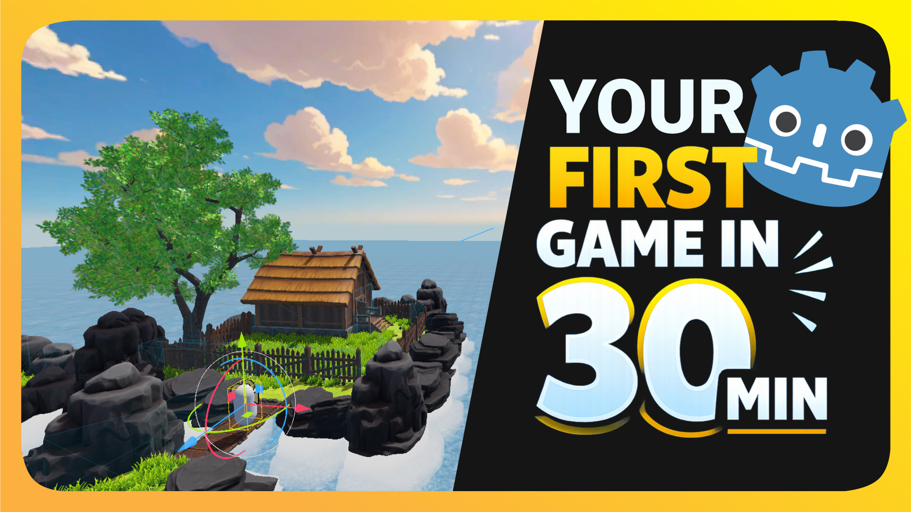

# Welcome

Welcome to **Godot Sensei Docs** 👋

This is the companion documentation for [my YouTube channel](https://www.youtube.com/@godotsensei), where I teach Godot through fun and practical tutorials.  
Here, you’ll find written guides, extra tips, and structured notes that go along with my videos.

I highly recommend using these docs together with the videos to get the best learning experience.

---

## Complete Beginner Series

### Make Your First Game in Godot 🎮 30 Minute Beginner Course

### Resources
- 📚 [Walking Simulator Documentation](./category/walking-sim)
- ▶️ [Full Video](https://www.youtube.com/watch?v=auqOU55M90U)
- ▶️ [Playlist](https://www.youtube.com/playlist?list=PLPdCd0OwI4tarX0u6ukZkMruBQ5AtAMQ0)

---

## 📌 Notes
More tutorials and documentation will be added over time, so feel free to come back and explore new content.

**Wish you the best on your game dev journey!**  
*~ Godot Sensei*